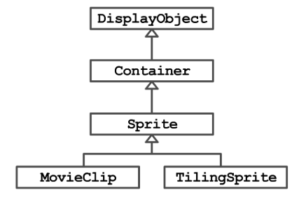

# 2.2构建视差卷轴

### PIXI.js 扩展显示对象
显示对象的基本类型是`PIXI.DisplayObject`类，每个其他显示对象都继承该类。此类表示对象呈现到屏幕所需的绝对必要元素。
> `PIXI.Container`允许对象充当其他显示对象的容器,可以捆绑元素为一个整体：
``` javascript
let cat = new PIXI.Sprite(["cat.png"])
cat.positon.set(16,16)

let hedgehog = new PIXI.Sprite(["hedgehog.png"])
hedgehog.positon.set(32,32)

let tiger = new PIXI.Sprite(["tiger.png"])
tiger.positon.set(64,64)

//创建一个animals容器（container）把他们聚合在一起
let ainmals = new PIXI.Container();

//然后用 addChild 去把精灵图 添加到分组中
ainmals.addChild(cat)
ainmals.addChild(hedgehog)
ainmals.addChild(tiger)

//最后把分组添加到舞台上（把三个精灵捆绑在一起，看作一个整体）
app.stage.addChild(animals)

//注：stage对象也是一个Container。它是所有Pixi精灵的根容器
//操作animals，上面三个精灵会一起变动
```
> 也可以用`PXIX.Sprite`和`PIXI.TilingSpite`

### 对`PIXI.tilingSpite`进行封装
far.js
``` javascript
function Far() {
    var farTexture = PIXI.Texture.fromImage('./img/11.png')
    PIXI.extras.TilingSprite.call(this, farTexture, 512, 256)
    this.position.x = 0;
    this.position.y = 0;
    this.tilePosition.x = 0;
    this.tilePosition.y = 0;
}
Far.prototype = Object.create(PIXI.extras.TilingSprite.prototype)
Far.prototype.update = function () {
    this.tilePosition.x -= 0.64;
};
```

index.html
``` html
    <script src="./pixi.min.v4.5.5.js"></script>
    <script src="./far.js"></script>
    <body onload="init();">
        <canvas></canvas>
    </body>

    <script>
        function init() {
            stage = new PIXI.Container();
            renderer = PIXI.autoDetectRenderer(
                512,
                384, {
                    view: document.querySelector("canvas")
                }
            )
            far = new Far()
            stage.addChild(far)
            game()
        }

        function game() {
            far.update()
            renderer.render(stage)
            //每秒60帧的刷新速度回调函数
            requestAnimationFrame(game);
        }
    </script>
```

### 创建滚动条类
> 它的构造函数需要引用stage(Pixi.Container),而且它不会继承任何东西
``` html
<!DOCTYPE html>
<html lang="en">

<head>
    <meta charset="UTF-8">
    <meta name="viewport" content="width=device-width, initial-scale=1.0">
    <meta http-equiv="X-UA-Compatible" content="ie=edge">
    <title>Document</title>
    <script src="./pixi.min.v4.5.5.js"></script>
    <script src="./far.js"></script>
    <script src="./scroller.js"></script>
</head>

<body onload="init();">
    <canvas></canvas>
</body>

</html>
<script>
    function init() {
        stage = new PIXI.Container();
        renderer = PIXI.autoDetectRenderer(
            512,
            384, {
                view: document.querySelector("canvas")
            }
        )
        scroller = new Scroller()
        game()
    }

    function game() {
        scroller.update()
        renderer.render(stage)
        //每秒60帧的刷新速度回调函数
        requestAnimationFrame(game);
    }
</script>
```

far.js
``` javascript
function Far() {
    var farTexture = PIXI.Texture.fromImage('./img/11.png')
    PIXI.extras.TilingSprite.call(this, farTexture, 512, 256)
    this.position.x = 0;
    this.position.y = 0;
    this.tilePosition.x = 0;
    this.tilePosition.y = 0;
}
Far.prototype = Object.create(PIXI.extras.TilingSprite.prototype)
Far.prototype.update = function () {
    this.tilePosition.x -= 0.64;
};
```

scroller.js
``` javascript
function Scroller() {
    this.far = new Far();
    stage.addChild(this.far)
}

Scroller.prototype.update = function () {
    this.far.update()
}
```

### 添加视口
``` html
<!DOCTYPE html>
<html lang="en">

<head>
    <meta charset="UTF-8">
    <meta name="viewport" content="width=device-width, initial-scale=1.0">
    <meta http-equiv="X-UA-Compatible" content="ie=edge">
    <title>Document</title>
    <script src="./pixi.min.v4.5.5.js"></script>
    <script src="./far.js"></script>
    <script src="./scroller.js"></script>
</head>

<body onload="init();">
    <canvas></canvas>
</body>

</html>
<script>
    function init() {
        stage = new PIXI.Container();
        renderer = PIXI.autoDetectRenderer(
            512,
            384, {
                view: document.querySelector("canvas")
            }
        )
        scroller = new Scroller()
        game()
    }

    function game() {
        renderer.render(stage)
        //每秒60帧的刷新速度回调函数
        requestAnimationFrame(game);
    }
</script>
```

far.js
``` javascript
function Far() {
    var farTexture = PIXI.Texture.fromImage('./img/11.png')
    PIXI.extras.TilingSprite.call(this, farTexture, 512, 256)
    this.position.x = 0;
    this.position.y = 0;
    this.tilePosition.x = 0;
    this.tilePosition.y = 0;

    this.viewportX = 0;
}
Far.prototype = Object.create(PIXI.extras.TilingSprite.prototype)

Far.DELTA_X = 0.128

Far.prototype.setViewportX = function (newViewportX) {
    var distanceTravelled = newViewportX - this.viewportX;
    this.viewportX = newViewportX;
    this.tilePosition.x -= (distanceTravelled * Far.DELTA_X);
};
```

scroller.js
``` javascript
function Scroller() {
    this.far = new Far();
    stage.addChild(this.far)
}

Scroller.prototype.setViewportX = function (viewportX) {
    this.far.setViewportX(viewportX);
};
```
在浏览器控制台输入面代码，表面可以操作图像
``` javascript
scroller.setViewportX(50);
```

### 获取视口位置并让视口滚动
``` html
<!DOCTYPE html>
<html lang="en">

<head>
    <meta charset="UTF-8">
    <meta name="viewport" content="width=device-width, initial-scale=1.0">
    <meta http-equiv="X-UA-Compatible" content="ie=edge">
    <title>Document</title>
    <script src="./pixi.min.v4.5.5.js"></script>
    <script src="./far.js"></script>
    <script src="./scroller.js"></script>
</head>

<body onload="init();">
    <canvas></canvas>
</body>

</html>
<script>
    function init() {
        stage = new PIXI.Container();
        renderer = PIXI.autoDetectRenderer(
            512,
            384, {
                view: document.querySelector("canvas")
            }
        )
        scroller = new Scroller()
        game()
    }

    function game() {
        var newViewportX = scroller.getViewportX() + 5;
        scroller.setViewportX(newViewportX);
        renderer.render(stage)
        //每秒60帧的刷新速度回调函数
        requestAnimationFrame(game);
    }
</script>
```
far.js
``` javascript
function Far() {
    var farTexture = PIXI.Texture.fromImage('./img/11.png')
    PIXI.extras.TilingSprite.call(this, farTexture, 512, 256)
    this.position.x = 0;
    this.position.y = 0;
    this.tilePosition.x = 0;
    this.tilePosition.y = 0;

    this.viewportX = 0;
}
Far.prototype = Object.create(PIXI.extras.TilingSprite.prototype)

Far.DELTA_X = 0.128

Far.prototype.setViewportX = function (newViewportX) {
    var distanceTravelled = newViewportX - this.viewportX;
    this.viewportX = newViewportX;
    this.tilePosition.x -= (distanceTravelled * Far.DELTA_X);
};
```
scroller.js
``` javascript
function Scroller() {
    this.far = new Far();
    stage.addChild(this.far)

    this.viewportX = 0;
}

Scroller.prototype.setViewportX = function (viewportX) {
    this.viewportX = viewportX;
    this.far.setViewportX(viewportX);
};

Scroller.prototype.getViewportX = function () {
    return this.viewportX;
};
```

### 终极整合
``` html
<!DOCTYPE html>
<html lang="en">

<head>
    <meta charset="UTF-8">
    <meta name="viewport" content="width=device-width, initial-scale=1.0">
    <meta http-equiv="X-UA-Compatible" content="ie=edge">
    <title>Document</title>
    <script src="./pixi.min.v4.5.5.js"></script>
    <script src="./far.js"></script>
    <script src="./scroller.js"></script>
    <script src="./main.js"></script>
</head>

<body onload="init();">
    <canvas></canvas>
</body>

</html>
<script>
    function init() {
        main = new Main();
    }
</script>
```
far.js
``` javascript
function Far() {
    var farTexture = PIXI.Texture.fromImage('./img/11.png')
    PIXI.extras.TilingSprite.call(this, farTexture, 512, 256)
    this.position.x = 0;
    this.position.y = 0;
    this.tilePosition.x = 0;
    this.tilePosition.y = 0;

    this.viewportX = 0;
}
Far.prototype = Object.create(PIXI.extras.TilingSprite.prototype)

Far.DELTA_X = 0.128

Far.prototype.setViewportX = function (newViewportX) {
    this.viewportX = newViewportX;
    this.tilePosition.x -= (this.viewportX * Far.DELTA_X);
};
```
scroller.js
``` javascript
function Scroller(stage) {
    this.far = new Far();
    stage.addChild(this.far)

    this.viewportX = 0;
}

Scroller.prototype.setViewportX = function (viewportX) {
    this.viewportX = viewportX;
    this.far.setViewportX(viewportX);
};

Scroller.prototype.getViewportX = function () {
    return this.viewportX;
};
```
main.js
``` javascript
function Main() {
    this.stage = new PIXI.Container();
    this.renderer = PIXI.autoDetectRenderer(
        512,
        384, {
            view: document.querySelector("canvas")
        }
    );

    this.scroller = new Scroller(this.stage);

    requestAnimationFrame(this.update.bind(this));
}

Main.SCROLL_SPEED = 5;

Main.prototype.update = function () {
    this.scroller.setViewportX(Main.SCROLL_SPEED);
    this.renderer.render(this.stage);
    requestAnimationFrame(this.update.bind(this));
};
```